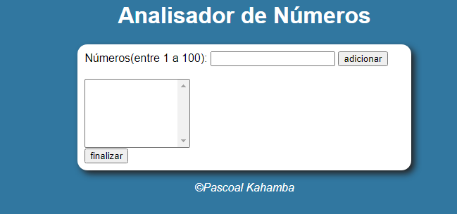
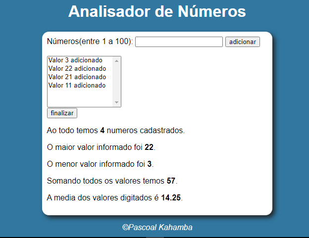

# Analisador de Números

Este `projeto` foi desenvolvido pra fins de exercícios em `Javascript`. O projeto funciona da seguinte forma o `usuário` digita um ou mais valores no campo `Números(entre 1 a 100)` clica no botão `Adicionar` vai adicionando os números em um `Array` os números não podem ser repetitivos e têm que estar no `intervalo` entre `1 a 100` o projeto vai exibir os números digitados pelo usuário no `Textarea`. Assim que o usuário decidir analisar os tais números vai clicar no botão abaixo `finalizar` rápidamente o projeto vai `retornar` uma lista com as segunites informações:

- O total de números digitados.
- O maior número digitado.
- O menor número digitado.
- A soma dos números digitados.
- A média dos respectivos números.

## Tecnologias

As seguintes ferramentas foram usadas na constuição deste projeto:

- HTML
- CSS
- JAVASCRIPT

#

Feito por Pascoal Kahamba meu [Linkedin](https://www.linkedin.com/in/pascoal-kahamba-7b43bb233?lipi=urn%3Ali%3Apage%3Ad_flagship3_profile_view_base_contact_details%3BTg8LEKayToyytOX1pVAQ%2Bg%3D%3D)

[Clique aqui se desejas ver aplicação rodando.😎](https://analisadorde-numeros.vercel.app/)
